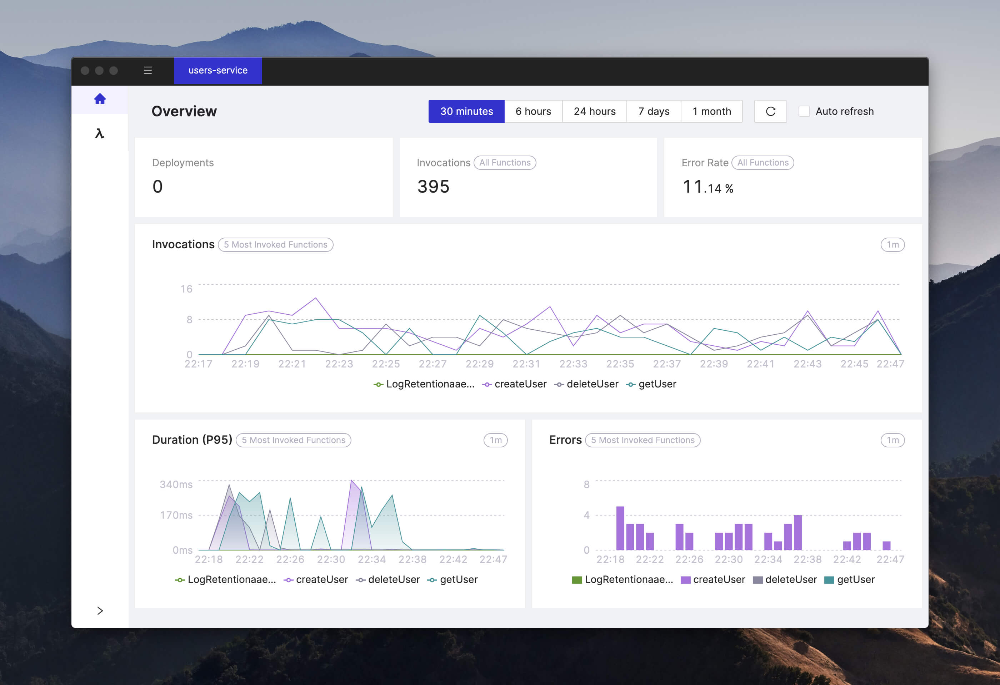
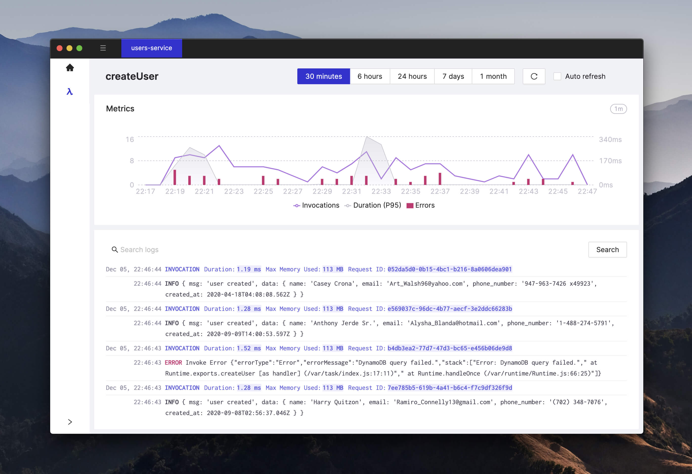

# Cloudash

A monitoring and troubleshooting app for serverless architectures. Cloudash is a desktop app that allows you quickly access logs and metrics of your Lambda functions (and other services soon!). Think of it as a desktop app for AWS, tailored for the serverless use case.

## [Download v0.3 (macOS)](https://github.com/cloudashdev/cloudash/releases/download/0.3.0/Cloudash-0.3.0-mac.zip)

## Features

- Quick access to metrics and logs of your AWS Lambda functions (other services soon)
- Everything you need to know about your Serverless service health on one screen
- Easy navigation between services on different accounts and regions
- Support for AWS CDK, AWS SAM, and Serverless Framework
- Support for MFA and SSO profiles

## Screens

### Overview screen - the most important metrics for your serverless app

- number of deployments
- invocations
- error rate
- duration (P95)
- errors

## Function screen

- the most important metrics for your Lambda function (invocations, duration (P95), and errors)
- logs grouped by invocations
- logs search

## Disclaimer

_The current versions (0.x) are free and will work for the next 3 months. Version 1.0 and above will be paid._

_Cloudash uses AWS SDK to get metrics data. Be warned that [AWS charges for those API calls.](https://aws.amazon.com/cloudwatch/pricing/)_
